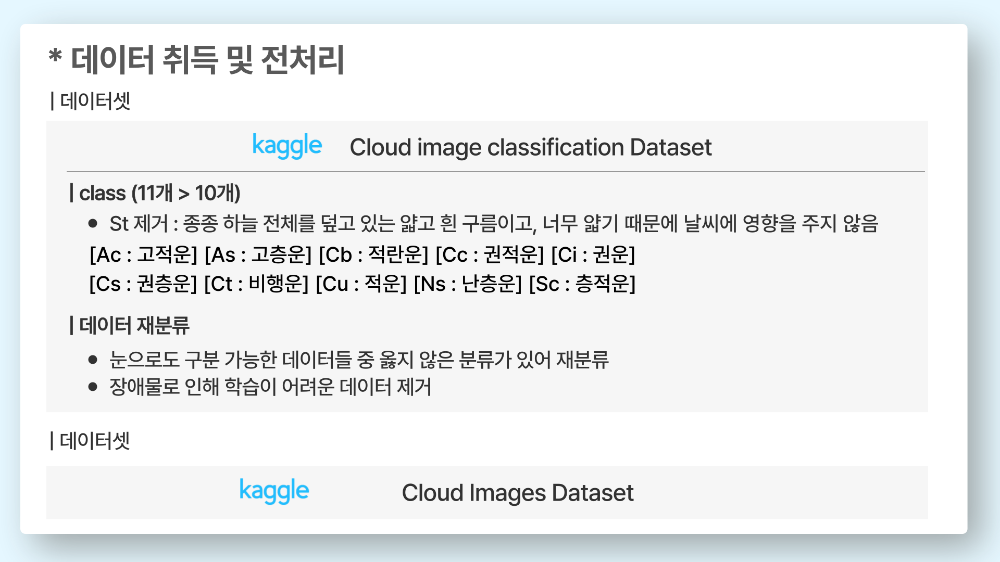
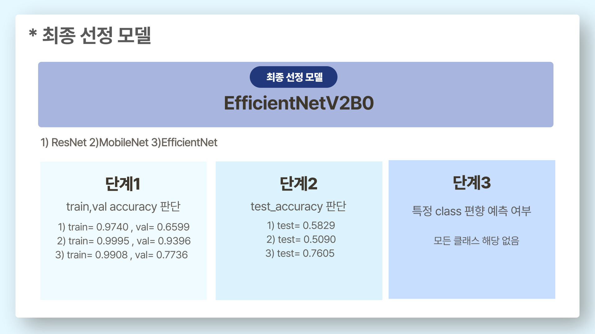

# SkyMood | CNN 기반 구름 이미지 분류

**프로젝트 이름** : SkyMood

**팀 이름** : SkyMood

**프로젝트 개요** : 구름 이미지 분류를 통한 날씨 예측

--------

### **개발 배경**
1. 특정 구름은 날씨와 연관이 있지만, 구름이 반드시 흐린 날씨와 동반되지는 않음.
2. '동물의 숲'과 같은 게임에서도 날짜 시드를 찾기 위해 구름과 날씨 정보를 활용함.
대부분의 이용자들은 구름이 있기 때문에 맑은 날이라고 생각하지 않음. 따라서, 구름과 날씨 정보를 결합해 날짜 시드를 찾는 것은 정확하지 않음.

### **개발 목적**

**따라서 구름 이미지 분류를 통해 날씨를 예측해주는 서비스를 제공하고자 함**

-------

### **프로젝트 소개**
- 프로젝트 기간 : 2024.11.26 ~ 11.28
- 팀원 : 이예진, 조은비, 허채연
- 목적 : 구름 이미지 분류를 통한 날씨 예측

--------
### **데이터 취득 및 전처리**

**데이터셋** 
1) https://www.kaggle.com/datasets/nakendraprasathk/cloud-image-classification-dataset
2) https://www.kaggle.com/datasets/nuttidalapthanachai/cloud-image-dataset

-----

### **Model 학습**
1) 조은비 : ResNet
   - train_accuracy: 0.9740, train_loss: 0.0820
   - val_accuracy: 0.6599 , val_loss: 1.5845
   - test_accuracy: 0.5829

  
  
2) 이예진 : MobileNet
   - train_accuracy: 0.9995, train_loss: 0.0018
   - val_accuracy: 0.9386 , val_loss: 0.3286
   - test_accuracy: 0.5090

  
3) 허채연 : EfficientNetV2B0
   - train_accuracy: 0.9886, train_loss: 0.0392
   - val_accuracy: 0.7736 , val_loss: 1.0191
   - test_accuracy: 0.7605

**최종 선택 모델**

-----
### **시연 영상**

[허채연의 채널에서 보기](https://youtu.be/jdU_7EJn72U)

-----

### **기대 효과**

- 직관적인 날씨를 쉽고 빠르게 파악
- 기상청 자료와의 결합을 통한 기상 예보 정확도 보완
- 일반 사용자의 접근성 향상 ( 스마트폰으로 사진을 찍어 웹 서비스에 올리면 빠르게 서비스 이용 가능)

  
----
### **소감**

**예진**
- 불러온 데이터를 활용하기 전에 데이터의 라벨링이 잘 되어있는지, 제대로된 데이터인지 확인하는 작업의 중요성을 느꼈습니다.

**은비**
- ResNet 모델을 구현하면서 훈련 데이터가 적은 경우 레이어 수를 줄여 과적합 방지할 수 있음을 깨달았습니다.
- 이 밖에도 프로젝트 수행을 하면서 팀원분들께 배운 내용이 많았습니다. 다들 정말 수고하셨습니다 :)

**채연**
- 데이터 수집 과정에서 라벨링이 잘 돼있는 지 확인하는 작업이 중요하다는 것을 깨달음
- 문제가 생겼을 때 어디서 문제가 발생했고, 이 문제를 해결하기 위해 시도한 과정들을 정리하는 시간이 필요함을 깨달음
  -  정리하면서 실수를 발견하게 되는 경우 多

---------

